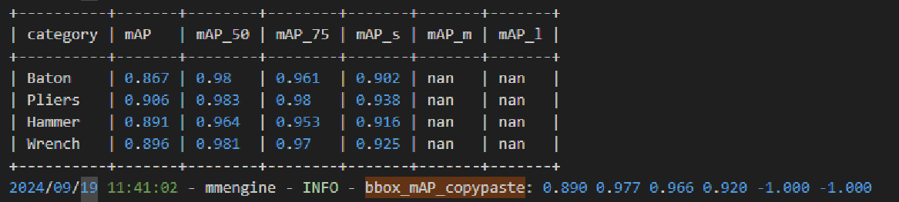
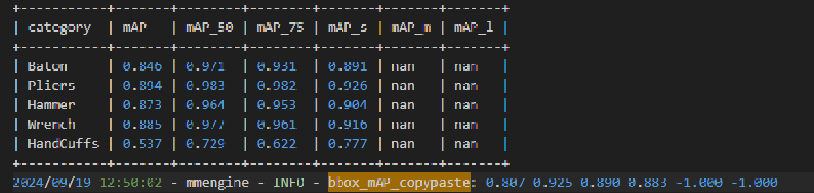

# 项目介绍
基于 mmdetection 框架的增量小样本X光检测 
mmdetection框架本身未提供增量小样本设定相关功能，本项目部分修改了mmdetection框架源码以支持该设定
本项目是在违禁品X光检测场景提供了一个小样本增量设定的mmdetection框架使用的通用方法，可自然使用到其他场景中。 
如对你有所帮助，请留下一个小小star~~ ^.^
# 环境搭建
mmdetection 3.3.0 根据[官方指导](https://mmdetection.readthedocs.io/zh-cn/latest/get_started.html)配置

# 数据集介绍
[PIDRAY](https://github.com/lutao2021/PIDray)  
本项目对该仓库模型训练代码进行了mmdetection的版本迁移，2.25 -> 3.3, 可参考mmdetection提供的版本迁移文档。
12类违禁品X光检测数据集

# 任务设定
基类：Baton Pliers Hammer Wrench 警棍 钳子 锤子 扳手
新类：handCuffs 手铐
基类使用全部训练数据，在增量训练时新类与旧类仅使用10张训练样本 （10-shot）进行微调

# 运行方式
下载数据集后，修改数据集config（mmdetection/configs/_base_/datasets/pidray_dataset_4+1.py）中路径  
##  基类训练
使用配置文件 /home/xray/xray/mmdetection/configs/cascade_rcnn/pidray_base4_cascade_mask_rcnn_r101_with_R0R1.py 
设定其中的num_classes = 4 
数据集配置文件 /home/xray/xray/mmdetection/configs/_base_/datasets/pidray_dataset_4+1.py
设定dataload为incremental对应的 位于文件最后
运行命令
```
CUDA_VISIBLE_DEVICES=2,3,4,5 bash ./tools/dist_train.sh configs/cascade_rcnn/pidray_incremental1_cascade_mask_rcnn_r101_with_R0R1.py  4
CUDA_VISIBLE_DEVICES=2,3,4,5 bash tools/dist_train.sh configs/cascade_rcnn/pidray_base4_cascade_mask_rcnn_r101.py 4 --auto-scale-lr
```

## 扩展分类头维度
使用mmdetection/mmdet/utils/change_checkpoints.py 调整最后的bbox head和mask head 分类头维度，注意bbox head含有背景类，为实际类别+1，背景类是最后一维。

例：
原bbox head fc_cls weight维度为(5,1024),对应4类基类和1类背景类，在进行维度扩展后，为(6,1024), 对应4类基类+1类新类+1类背景类。   
在进行权重参数赋值时，需要注意将原参数的前4维赋值到新参数的前四维，最后一维（背景）复制到新参数的最后一维，空出新参数的倒数第2维对应新增类别的分类。  
若简单的将旧参数赋值到新参数的前5维，会导致错位，原背景类参数对应到新类别的参数，导致测试结果大部分分到了背景类和新类，基类几乎无预测结果。

错位结果：  
混淆矩阵右侧背景类预测很多，前四类基类几乎无预测。
## 增量训练

/home/xray/xray/mmdetection/mmdet/engine/hooks/freeze_part_param_hook.py 是否需要冻结背景类
/home/xray/xray/mmdetection/configs/_base_/schedules/pid_schedule.py 增量过程训练epoch设为100，设置最大保存模型数量

小样本训练不适合开多卡，每个卡上batch size较小，导致不稳定。

运行命令
```
python tools/train.py configs/cascade_rcnn/pidray_incremental1_cascade_mask_rcnn_r101.py --auto-scale-lr
```

## 测试

测试
```
CUDA_VISIBLE_DEVICES=2,3,4,5 bash ./tools/dist_test.sh configs/cascade_rcnn/pidray_incremental1_cascade_mask_rcnn_r101_with_R0R1.py ./workdir/cascade_pidray_base4/epoch_12_modified.pth 4 --out ./workdir/cascade_pidray_incremental1
```
保存pkl文件用于混淆矩阵分析

混淆矩阵分析
```
python tools/analysis_tools/confusion_matrix.py configs/cascade_rcnn/pidray_incremental1_cascade_mask_rcnn_r101_with_R0R1.py  ./workdir/cascade_pidray_incremental1/result.pkl  ./workdir/cascade_pidray_incremental1
```
# 结果展示  
修改mmdetection/mmdet/evaluation/metrics/coco_metric.py  classwise=True 可查看每类准确率
基类训练结果：  

  
增量小样本训练结果：  


# mmdetection 源码修改
按文件夹说明
## configs
### datasets
mmdetection/configs/_base_/datasets/pidray_dataset_4+1.py
PIDRAY 数据集组织格式与coco相同，因此直接设置为coco类型即可
```python
dataset_type = 'CocoDataset'
data_root = '/home/xray/data/pidray/'
```

直接通过metainfo选择数据集中部分类别进行训练，mmdetection会自动根据metainfo指定的类别进行过滤。
```python
# 4个基类：Baton Pliers Hammer Wrench 警棍 钳子 锤子 扳手 4个  标号：0，1，2，5
base_metainfo = {
    'classes': ('Baton', 'Pliers', 'Hammer', 'Wrench'),
    'palette': [(220, 20, 60), (119, 11, 32), (0, 0, 142), (0, 0, 230)]
}
# 1个新类： handCuffs 手铐 标号 9
incremental_metainfo = {
    'classes': ('Baton', 'Pliers', 'Hammer', 'Wrench', 'HandCuffs'),
    'palette': [(220, 20, 60), (119, 11, 32), (0, 0, 142), (0, 0, 230),(0, 0, 192)]
}
```
并在dataloader中指定metainfo，例如：
```python
train_dataloader_base = dict(
    batch_size=8,
    num_workers=2,
    persistent_workers=True,
    sampler=dict(type='DefaultSampler', shuffle=True),
    batch_sampler=dict(type='AspectRatioBatchSampler'),
    dataset=dict(
        type=dataset_type,
        data_root=data_root,
        metainfo=base_metainfo,
        ann_file='annotations/xray_train.json',
        data_prefix=dict(img='train/'),
        filter_cfg=dict(filter_empty_gt=True, min_size=32),
        pipeline=train_pipeline_base,
        backend_args=backend_args))  
```

其中还添加了filter_cfg参数，用于小样本数据过滤。
### schedules
mmdetection/configs/_base_/schedules/pidray_schedule.py
增量训练与基类训练的训练设置，需进行手动调整  
### 模型文件
mmdetection/configs/cascade_rcnn/pidray_base4_cascade_mask_rcnn_r101.py
mmdetection/configs/cascade_rcnn/pidray_incremental1_cascade_mask_rcnn_r101.py 

使用cascade mask rcnn模型，修改num_classes 为对应的类别数（基类4，增量5，不需考虑背景类，框架自动处理）
## mmdet 
### coco数据集添加小样本过滤
mmdetection/mmdet/datasets/coco.py
修改coco数据集，filter_data部分，增加filter_cfg字典的K_shot键 
### hooks 添加训练过程冻结（可选）
mmdetection/mmdet/engine/hooks/freeze_part_param_hook.py 新建文件，并在init中注册。更多可参考官方教程hooks相关内容 
可在模型config中添加此hook（已注释掉），可使得在每轮训练过程保证基类的分类头检测头参数不被更新。
### 完成基类训练后扩展分类头维度
mmdetection/mmdet/utils/change_checkpoints.py  
调整最后的bbox head和mask head 分类头维度，注意bbox head含有背景类，为实际类别+1，背景类是最后一维。
